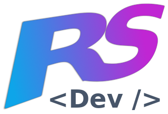

<a name="readme-top"></a>

<div align="center">

  
  <br/>

  <h3><b>Articools for Helpjuice</b></h3>

</div>

<!-- TABLE OF CONTENTS -->

# 📗 Table of Contents

- [📖 About the Project](#about-project)
  - [🛠 Built With](#built-with)
    - [Tech Stack](#tech-stack)
    - [Key Features](#key-features)
  - [🚀 Live Demo](#live-demo)
- [💻 Getting Started](#getting-started)
  - [Setup](#setup)
  - [Prerequisites](#prerequisites)
  - [Install](#install)
  - [Usage](#usage)
  - [Run tests](#run-tests)
  - [Deployment](#triangular_flag_on_post-deployment)
- [👥 Authors](#authors)
- [🔭 Future Features](#future-features)
- [🤝 Contributing](#contributing)
- [⭐️ Show your support](#support)
- [🙏 Acknowledgements](#acknowledgements)
- [❓ FAQ](#faq)
- [📝 License](#license)

<!-- PROJECT DESCRIPTION -->

# 📖 Articools <a name="about-project"></a>


**Articools** is a web app built with Ruby on Rails that allows the user to search for existing articles along tracking and saving analytics (trends) about their searches. Everything in real-time.

## 🛠 Built With <a name="built-with"></a>

### Tech Stack <a name="tech-stack"></a>

<details>
  <summary>Client</summary>
  <ul>
    <li>Hotwire Turbo</a></li>
    <li>Hotwire Turbo</a></li>
    <li>Tailwind</a></li>
  </ul>
</details>

<details>
  <summary>Server</summary>
  <ul>
    <li>Ruby on Rails</li>
    <li>Redis</li>
  </ul>
</details>

<details>
<summary>Database</summary>
  <ul>
    <li>PostgreSQL</li>
  </ul>
</details>

<!-- Features -->

### Key Features <a name="key-features"></a>


- **Real-time searching while the user types.**
- **Query tracking. Once theuser submits a full search or loses the focu of the input, that query term is recorded as a user's trend**
- **Full real-time. Along with the searching, the updates made to the trends are changed right away using websockets (turbo-streams)**

<p align="right">(<a href="#readme-top">back to top</a>)</p>

<!-- LIVE DEMO -->

## 🚀 Live Demo <a name="live-demo"></a>


- [Live Demo Link](https://articools.fly.dev/)

<p align="right">(<a href="#readme-top">back to top</a>)</p>

<!-- GETTING STARTED -->

## 💻 Getting Started <a name="getting-started"></a>


To get a local copy up and running, follow these steps.

### Prerequisites

In order to run this project you need:

- Having Ruby installed
- Having Rails installed
- Having PostgreSQL installed
- Having Redis installed

### Setup

Clone this repository to your desired folder:


```sh
  git clone git@github.com:rskinnerc/articools.git
```

### Install

Install this project with:


```sh
  cd articools
  bundle install
```

### Usage

To run the project, execute the following command:


```sh
  rails db:fixtures:load FIXTURES_PATH=spec/fixtures
  rails server
```

### Run tests

To run tests, run the following command:

```sh
  rspec
```

### Deployment

You can deploy this project using:

- Your favorite hosting/cloud provider

<p align="right">(<a href="#readme-top">back to top</a>)</p>

<!-- AUTHORS -->

## 👥 Authors <a name="authors"></a>


👤 **Ronald Skinner**

- GitHub: [@rskinnerc](https://github.com/rskinnerc)
- Twitter: [@XSkinner](https://twitter.com/XSkinner)
- LinkedIn: [LinkedIn](https://linkedin.com/in/rskinnerc)

<p align="right">(<a href="#readme-top">back to top</a>)</p>

<!-- FUTURE FEATURES -->

## 🔭 Future Features <a name="future-features"></a>

- [ ] **Adding Devise athentication**
- [ ] **Adding an Admin Panel to allow admins create articles**
- [ ] **Improve user events tracking**

<p align="right">(<a href="#readme-top">back to top</a>)</p>

<!-- CONTRIBUTING -->

## 🤝 Contributing <a name="contributing"></a>

Contributions, issues, and feature requests are welcome!

Feel free to check the [issues page](../../issues/).

<p align="right">(<a href="#readme-top">back to top</a>)</p>

<!-- SUPPORT -->

## ⭐️ Show your support <a name="support"></a>


If you like this project.. **DON'T HESITATE TO HIRE ME**. I'm available for hire.

<p align="right">(<a href="#readme-top">back to top</a>)</p>

<!-- ACKNOWLEDGEMENTS -->

## 🙏 Acknowledgments <a name="acknowledgements"></a>


I would like to thank Microverse and all the people who made this possible.

<p align="right">(<a href="#readme-top">back to top</a>)</p>

<!-- FAQ (optional) -->

## ❓ FAQ <a name="faq"></a>

- **How did you handle avoiding requesting a search for every character the user entered?**

  - I implemented a debouncer. This way, the search is only triggered after a certain amount of time. This way, the user can type as fast as they want without triggering a search for every character.

- **How did you handle recording only full searches?**

  - I added a `search_session_id` to every request. This way, I can track the searches that belong to the same session. Once the user submits a full search or loses the focus of the input that id changes and in the server-side I know it is not the same search; then, that query term is recorded as a user's trend.

- **How did you manage to make everything real-time?**

  - I made heavy use of websockets. I used turbo-streams to update the trends in real-time. I also used turbo-streams to update the search results in real-time. In general, I used Turbo to make everything real-time and fast.

- **How did you ensure evrything was working?**

  - I developed almost the full app using TDD. I wrote test before adding or changing features.

<p align="right">(<a href="#readme-top">back to top</a>)</p>

<!-- LICENSE -->

## 📝 License <a name="license"></a>

This project is [MIT](./MIT) licensed.


<p align="right">(<a href="#readme-top">back to top</a>)</p>
